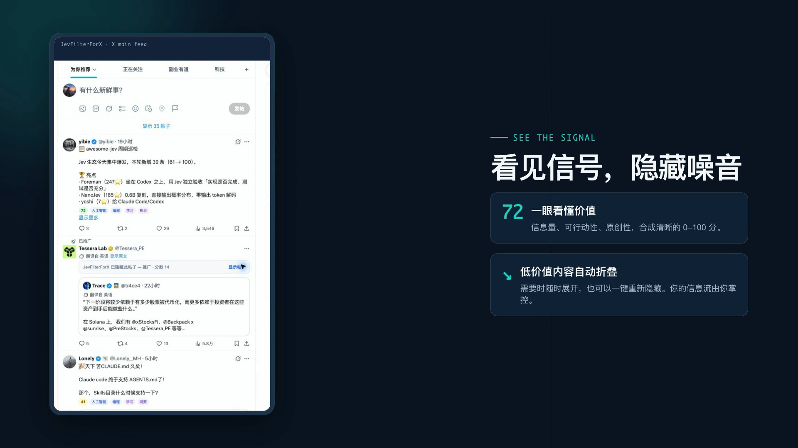

# JevFilterForX

JevFilterForX is a browser extension for turning the X timeline into a higher-signal feed. It scores visible posts, explains the score with lightweight labels, and folds posts that match your filters.

[](https://github.com/grayrepo-byte/jev_filter_for_x/actions/workflows/ci.yml)

[中文说明](README.zh-CN.md) · [Author on X](https://x.com/Grayrepo)

## Demo

<video controls poster="assets/promo/jevfilterforx-promo-poster.png" src="assets/promo/jevfilterforx-promo.mp4" width="960">
  Your browser does not support embedded video. [Download the demo video](assets/promo/jevfilterforx-promo.mp4).
</video>

[Download or open the demo video](assets/promo/jevfilterforx-promo.mp4)



## What it does

- Scores posts on a 0–100 scale.
- Uses information signal, actionability, and originality as the main scoring dimensions.
- Shows the score and topic/value labels directly in the X timeline.
- Folds low-value posts while keeping them available to expand.
- Lets you hide the same post again after expanding it.
- Hides attached images and videos together with a folded post.
- Provides an options page in its own tab for API key, language, topics, value preferences, category filters, and score thresholds.
- Includes English, Simplified Chinese, Japanese, Spanish, and German UI translations.

## Why Jev for real-time filtering?

Timeline filtering is a high-frequency classification task. Jev is designed for fast, low-cost requests, which makes continuous filtering practical. Compared with routing every post through a general-purpose LLM, a lightweight Jev classification request is a better fit for low latency and predictable per-post cost.

## Scoring model

Jev rates each dimension from 0 to 4 and converts the weighted result to 0–100:

```text
(signal × 40% + actionability × 35% + originality × 25%) ÷ 4 × 100
```

- **0–29**: Low
- **30–69**: Medium
- **70–100**: High

Topic, value, and noise categories are evaluated separately, so category filters and Focus Mode can still fold a post regardless of its score.

## Install

### Download a packaged build

The GitHub Actions workflow builds a Chrome extension ZIP for every push to `main` and every pull request. To download the latest packaged build:

1. Open the [latest successful CI run](https://github.com/grayrepo-byte/jev_filter_for_x/actions/workflows/ci.yml).
2. Open the run and download the `jevfilterforx-chrome-<commit>` artifact.
3. Unzip the artifact, then open `chrome://extensions`, enable **Developer mode**, and choose **Load unpacked**.
4. Select the unzipped folder that contains `manifest.json`.

### Build locally

1. Install dependencies:

   ```bash
   npm install
   ```

2. Build the extension:

   ```bash
   npm run build
   ```

3. Open `dist/chrome-mv3` as an unpacked extension in Chromium-based browsers.
4. Open JevFilterForX settings, add a TypeSafe API key, and choose your filters.

Without an API key, the extension stays in local mock mode so the UI and filtering flow can still be explored.

## Development

```bash
npm run dev
npm test
npm run typecheck
npm run build
```

## Privacy and permissions

The API key is stored on the current device and is not synced to a Google account. Classification requests use the configured TypeSafe service. The extension only requests access to X/Twitter pages and the TypeSafe API endpoint needed for filtering.

## Project status

JevFilterForX is an early-stage project. Classification accuracy, retry behavior, and the timeline DOM integration are still being tuned as X changes.

## Author

[Grayrepo on X](https://x.com/Grayrepo)
